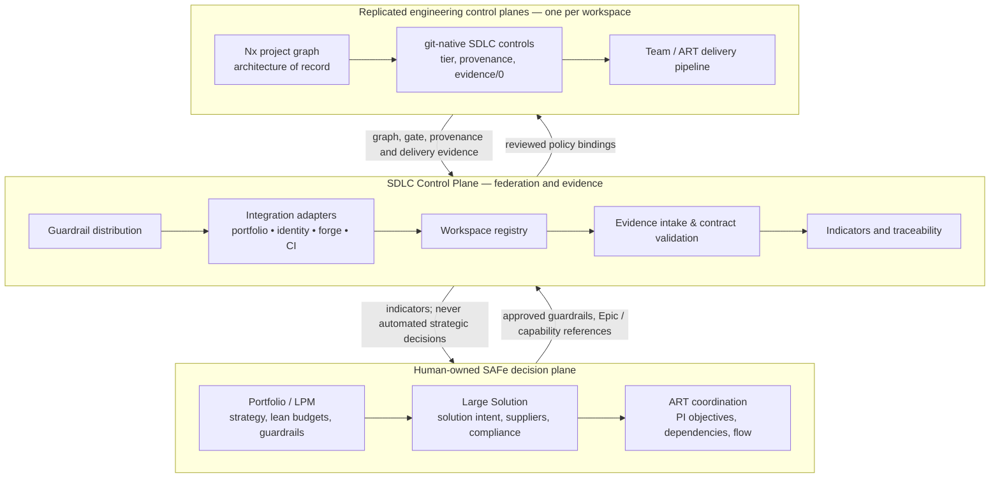

# Architecture overview

## Two-plane topology

## Runtime boundaries

`contracts` owns validation and version recognition. `workspace-registry` owns the static identity and ownership metadata of a workspace. `guardrail-policy` evaluates a received record against an approved policy and returns a deterministic recommendation. `indicators` derives descriptive metrics only. `control-plane-api` composes them behind a small HTTP seam. All are Nx projects under `packages/` and own a `project.json`; the API is the sole initial deployable artifact, while the others are libraries.

No package has a direct dependency on an external portfolio, finance, or identity provider. Those integrations are ports represented by documented contracts until a specific customer system and credentials are selected.

## Non-goals

- Autonomous approval, prioritisation, budgeting, staffing, or release authority
- Replacing the workspace's Nx graph, CI, or SDLC gate
- Treating evidence as proof of business outcomes or regulatory compliance
