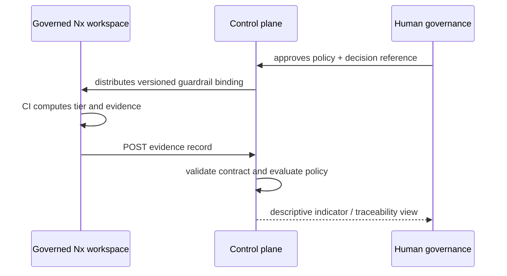

# Federation contracts

## Inbound: SDLC evidence

Each workspace posts an `evidence/0`-compatible record produced by `git-native-sdlc-controls`. This scaffold validates the minimum stable subset: schema version, change ID, tier, affected set, verification, result, tool identity, and timestamp. Unknown fields are preserved at the transport boundary by a production persistence adapter.

The contract is rejected when its schema version is not `evidence/0`; accepting a later shape on a guess can under-report a control failure.

## Inbound: workspace registration

Registration binds a repository to its value stream, solution, owners, evidence endpoint, and lifecycle status. It is configuration, reviewed like any other control input. A registration is not an assertion that the control plane can query that repository.

## Outbound: guardrail binding

`guardrails/0` contains a policy identifier, effective date, approving human/committee reference, and deterministic technical rules. It is distributed only after human approval. The policy is allowed to block an evidence record from satisfying the engineering policy; it may not make a portfolio decision.

## Evidence lifecycle

