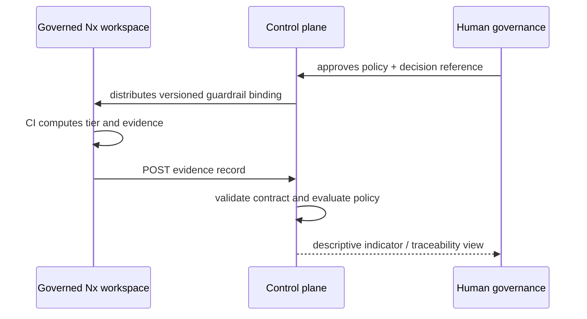

# Federation contracts

## Where the contract lives

[`packages/control-plane-api/openapi.json`](../packages/control-plane-api/openapi.json) is the source of truth for the HTTP surface: which routes exist, which status codes each one can answer with, which fields every request and response body carries, and the shape of the error envelopes. It also records, in prose, the five places where the running seam diverges from what the document's own vocabulary would otherwise imply, and what the 202 on evidence intake does and does not promise.

[`packages/control-plane-api/src/openapi.contract.test.mjs`](../packages/control-plane-api/src/openapi.contract.test.mjs) is what holds that document to the seam. It compares the documented routes and statuses against the route table the seam dispatches on and against the status literals in the seam's own source, and validates every observed response body against the schema the document names for that exact path, method and status. A document that over-claims fails there rather than in review.

This page carries the reasoning behind the contracts. It deliberately does not restate their fields: a second field list is a second source of truth, and nothing would notice the two drifting apart.

## Inbound: SDLC evidence

Each workspace posts an `evidence/0`-compatible record produced by `git-native-sdlc-controls`. This scaffold validates the minimum stable subset and tolerates unrecognised additive fields on a supported version; the fields themselves are the `EvidenceRecord` schema in `openapi.json`. Unknown fields are preserved at the transport boundary by a production persistence adapter — [ADR-0002](adr/0002-append-only-evidence-envelope-log.md) stores the record as `jsonb`, so an additive field survives storage as well as validation.

The contract is rejected when its schema version is not `evidence/0`; accepting a later shape on a guess can under-report a control failure.

## Inbound: workspace registration

Registration binds a repository to the ownership and value-stream context the control plane records against it; the fields are the `Workspace` schema in `openapi.json`. It is configuration, reviewed like any other control input. A registration is not an assertion that the control plane can query that repository.

## Outbound: guardrail binding

`guardrails/0` contains a policy identifier, effective date, approving human/committee reference, and deterministic technical rules. It is distributed only after human approval. The policy is allowed to block an evidence record from satisfying the engineering policy; it may not make a portfolio decision.

That paragraph is the one field list on this page that nothing checks. `guardrails/0` is configuration the control plane consumes, not a contract it serves, so it has no place in `openapi.json` and no contract test compares it to [`config/control-plane/guardrails.json`](../config/control-plane/guardrails.json). The two can drift apart silently today. What fixes it is policy administration: once policy has a served surface, it belongs in `openapi.json` and under the same test as everything else.

An earlier version of this page said that surface was coming in Sprint 2. It is not. Policy administration is threat-modelled in roadmap task 1.3, which produces a threat model rather than a route, and **no scheduled task builds the surface** — 2.1 is identity, 2.2 is evidence intake, 2.3 is operator telemetry. Sprint 2's definition of done nonetheless requires audit events for policy changes to be queryable, which overstates what any scheduled task delivers. Today the audit trail for a policy change is the reviewed commit to [`config/control-plane/`](../config/control-plane/): attributable, gated and evidence-producing, but readable only with the repository and `git log`, and exposed by no route. [ADR-0002](adr/0002-append-only-evidence-envelope-log.md) records that gap and hands the choice — rewrite the bullet, or add a task — to Gate 2.

## Evidence lifecycle

