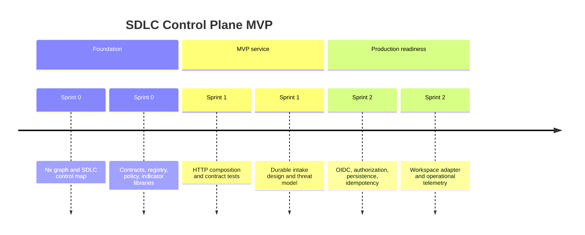
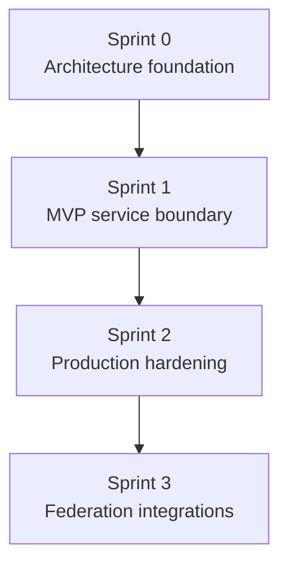

# SDLC Control Plane — Implementation Roadmap

**Prepared by**: codeaiforge
**Version**: 0.3 — September 2026
**Duration**: 6 weeks — Sprint 0 complete, then 3 sprints x 2 weeks (Sep 21 – Oct 30, 2026)
**Team**: Solo developer (founder)
**Methodology**: Vertical slices with proportionate, gate-computed SDLC controls

**MVP outcome**: one deployable API artifact that accepts validated engineering evidence, evaluates approved guardrails, and exposes descriptive indicators.

---

## Guiding Principles

| Principle                                     | In practice                                                                                                                                              |
| --------------------------------------------- | -------------------------------------------------------------------------------------------------------------------------------------------------------- |
| Federate, do not centralise                   | A workspace keeps its own Nx graph and CI gate. The control plane receives evidence; it never runs the workspace's pipeline.                             |
| Technical disposition over portfolio decision | Policy evaluation returns `accepted` / `needs-remediation` / `rejected` and a `policy_id`. It never emits an approval, a score, or a funding signal.     |
| Contracts before storage                      | The evidence and registration schemas are fixed and tested (0.2) before any persistence decision (1.2) constrains them.                                  |
| Declaration over detection                    | AI provenance and policy approval are recorded claims with named accountable references, not inferences the system makes on someone's behalf.            |
| A rule nothing checks is a convention         | Every control that matters gets an executable check — the component map, ADR numbering, graph fidelity. Documentation alone does not count as a control. |

---

## Sprint Overview

| Sprint | Dates                            | Theme                   | Outcome                                                                               | Exit gate                                                       |
| ------ | -------------------------------- | ----------------------- | ------------------------------------------------------------------------------------- | --------------------------------------------------------------- |
| 0      | Sep 20 – Sep 21, 2026 (complete) | Architecture foundation | Nx project graph, contracts, policy seam, registry, indicators, control-map generator | Local graph and all project tests pass                          |
| 1      | Sep 21 – Oct 2, 2026             | MVP service boundary    | HTTP composition seam, documented inbound/outbound contracts, integration test plan   | Valid evidence yields a deterministic technical disposition     |
| 2      | Oct 5 – Oct 16, 2026             | Production hardening    | Identity, authorization, durable idempotent storage, audit events, observability      | Authenticated end-to-end ingestion is traceable and recoverable |
| 3      | Oct 19 – Oct 30, 2026            | Workspace federation    | `ai-ready-nx-workspace` adapter and one named ALM/portfolio integration               | Contract and reconciliation tests pass in a sandbox             |

**Target MVP**: Oct 30, 2026 — end of Sprint 3.
**Buffer**: none built in. Sprint 2 is the pressure point; task 2.3 is a Should and is the
planned release valve if it slips (see the Sprint 2 risk checkpoint).

### Story Point Reference

| SP  | Effort    | Typical examples                                                                         |
| --- | --------- | ---------------------------------------------------------------------------------------- |
| 1   | < 2 hours | A single validator rule; one CI step; a doc section.                                     |
| 2   | Half day  | One library with its tests, no cross-package contract change.                            |
| 3   | ~1 day    | A composition seam, a spec document with contract tests, or a design ADR.                |
| 5   | 2–3 days  | A subsystem spanning several projects, or a control that changes CI behaviour.           |
| 8   | ~1 week   | Identity, durable storage, or an external-system integration with its own failure modes. |

SP for Sprint 0 are retrospective estimates, calibrated against the actual diffs recorded in `.ai/sprints/sprint-0/tasks/`. SP for Sprints 1–3 are forward estimates and carry normal estimation risk.

Solo developer capacity: planned at **~20 SP per 2-week sprint**. Sprint 0's 13 SP is not a
usable velocity baseline — it landed across a single day of AI-assisted commits rather than
a worked sprint, so it measures a burst, not a sustainable rate. Recalibrate at the end of
Sprint 1, which is the first sprint executed through the pipeline.

### Sprint Velocity Summary

| Sprint    | SP total | Risk level | Largest task                           | Notes                                                                                                                                                                                          |
| --------- | -------- | ---------- | -------------------------------------- | ---------------------------------------------------------------------------------------------------------------------------------------------------------------------------------------------- |
| 0         | 13       | Low        | 0.1 Nx boundaries + control map (5)    | Complete. All four tasks landed and the exit gate is verified green.                                                                                                                           |
| 1         | 9        | Medium     | Three tasks at 3 SP each               | Design-heavy: two of three tasks produce documents, not running code.                                                                                                                          |
| 2         | 21       | **High**   | 2.1 OIDC (8) and 2.2 durable store (8) | **Over capacity** — 21 SP against a ~20 SP solo sprint, and the only sprint with two 8-SP tasks. Deferring 2.3 brings it to 16 SP. Both Musts are gated on human approval of the threat model. |
| 3         | 13       | Medium     | 3.2 portfolio/ALM integration (8)      | Depends on an external integration owner who is not yet named. Absorbs 2.3 if it defers, taking the sprint to 18 SP.                                                                           |
| **Total** | **56**   |            |                                        | Average 14 SP per sprint against ~20 SP solo capacity.                                                                                                                                         |

### Task Priority (MoSCoW)

| Priority   | Meaning                                                                           | Action if behind schedule             |
| ---------- | --------------------------------------------------------------------------------- | ------------------------------------- |
| **Must**   | Blocks the sprint's Definition of Done or the next sprint's start                 | Cannot defer — reduce scope elsewhere |
| **Should** | Important but the sprint can close without it; typically blocks the _next_ sprint | Defer to next sprint's first wave     |
| **Could**  | Adds value but has no downstream dependency                                       | Drop or defer without impact          |

### Task Ordering and Execution Waves

Task numbers (0.1, 1.3, etc.) are **labels, not execution order**. The **"Depends on"** column defines the real sequencing. Tasks with no dependency relationship can be worked in any order.

Each sprint includes an **Execution Waves** section showing which tasks can proceed in parallel, grouped by dependency satisfaction.

---

## Sprint 0: Architecture foundation (Sep 20 – Sep 21, 2026 — complete)

**Goal:**

A reviewer can open the repository and see the federation boundary as executable structure rather than prose: five Nx projects with declared criticality, a component map derived from the live graph, and contract validators that reject an unknown schema version.

**Deliverables:**

| #   | Task                                                                 | SP  | Priority | Layer       | Depends on | Trace                           | Done when                                                                                        |
| --- | -------------------------------------------------------------------- | --- | -------- | ----------- | ---------- | ------------------------------- | ------------------------------------------------------------------------------------------------ |
| 0.1 | Establish Nx project boundaries and graph-derived SDLC component map | 5   | Must     | monorepo+ci | —          | NFR-1.1                         | Five Nx projects are discoverable and the map derives component paths and fan-in from the graph. |
| 0.2 | Define evidence, registration, and guardrail contracts               | 2   | Must     | api         | 0.1        | FR-1.1, FR-2.1, FR-3.1, NFR-1.1 | Contract validator accepts the supported subset and rejects an unknown schema version.           |
| 0.3 | Implement registry, policy evaluator, and descriptive indicators     | 3   | Must     | api         | 0.2        | FR-1.2, FR-3.2, FR-4.1          | Unit tests demonstrate no portfolio decision is made by technical policy evaluation.             |
| 0.4 | Compose the initial API seam                                         | 3   | Must     | api         | 0.2, 0.3   | FR-2.2                          | Health, workspace, evidence, and indicator paths are testable without network binding.           |

**Sprint total: 13 SP** — Low risk. Every task is additive scaffolding with no external dependency; 0.1 carries the only real uncertainty because the component map feeds the tiering gate.

**Execution waves:**

| Wave | Tasks | Rationale                                                                   |
| ---- | ----- | --------------------------------------------------------------------------- |
| 1    | 0.1   | No dependencies — the graph must exist before anything can be mapped to it. |
| 2    | 0.2   | Unblocked by 0.1; contracts need a project to live in.                      |
| 3    | 0.3   | Unblocked by 0.2; registry, policy and indicators all import the contracts. |
| 4    | 0.4   | Unblocked by 0.2 and 0.3; the seam composes what they expose.               |

**Risk checkpoint:**

The sprint succeeds if the component map derives from the live graph rather than a checked-in list. If the generator needs hand-maintained component entries for the Nx projects themselves, the blast-radius signal is not graph-derived and Sprint 1 should not start until it is.

**Definition of done:**

- [x] `pnpm exec nx graph` lists five projects with `scope:*` and `criticality:*` tags
- [x] `nx run-many -t test` is green across all five projects
- [x] `generate-component-map.mjs` emits component paths and fan-in taken from the graph
- [x] Project graph, contract boundaries and ADR-0001 agree
- [x] MVP architecture decision gate signed off by a human before Sprint 1 begins — **Go**, dsofianos (founder), 2026-09-21

---

## Sprint 1: MVP service boundary (Sep 21 – Oct 2, 2026)

**Goal:**

A governed workspace can read a published contract, post an evidence record against it, and get back a documented, deterministic disposition — with the storage and abuse questions answered on paper before either is built.

**Deliverables:**

| #   | Task                                                    | SP  | Priority | Layer    | Depends on | Trace            | Done when                                                                               |
| --- | ------------------------------------------------------- | --- | -------- | -------- | ---------- | ---------------- | --------------------------------------------------------------------------------------- |
| 1.1 | Define OpenAPI and error-response contract              | 3   | Must     | api      | 0.4        | FR-2.1, FR-2.2   | Contract tests exercise accepted, invalid, and incompatible evidence responses.         |
| 1.2 | Add append-only persistence port and idempotency design | 3   | Must     | database | 0.2        | NFR-3.1, NFR-6.1 | ADR identifies the store, idempotency key, retention, and audit-event boundary.         |
| 1.3 | Threat-model evidence ingress and policy administration | 3   | Must     | api+auth | 1.1        | NFR-2.1, NFR-6.1 | Threat model identifies trust boundaries, abuse cases, mitigations, and residual risks. |

**Sprint total: 9 SP** — Medium risk. Two of three tasks produce documents whose quality is not verifiable by a test run; 1.3 carries an NFR-6.1 trace and therefore a tier override.

**Execution waves:**

| Wave | Tasks    | Rationale                                                                                             |
| ---- | -------- | ----------------------------------------------------------------------------------------------------- |
| 1    | 1.1, 1.2 | Both depend only on completed Sprint 0 tasks and touch different layers, so they can run in parallel. |
| 2    | 1.3      | Unblocked by 1.1 — the threat model needs the published ingress contract to model against.            |

**Risk checkpoint:**

The signal is whether 1.2's ADR can name a concrete store and idempotency key without reopening the evidence schema. If it cannot, the contract fixed in 0.2 is wrong and Sprint 2 must not start on top of it.

**Definition of done:**

- [ ] An OpenAPI document describes all four routes and their error responses
- [ ] Contract tests cover accepted, invalid and incompatible evidence
- [ ] An ADR names the store, idempotency key, retention window and audit-event boundary
- [ ] A threat model documents trust boundaries, abuse cases, mitigations and residual risks

---

## Sprint 2: Production hardening (Oct 5 – Oct 16, 2026)

**Goal:**

An authenticated workload from a registered workspace can submit evidence that survives a restart, and an operator can see that it arrived, was processed, and is retained under policy.

**Deliverables:**

| #   | Task                                                               | SP  | Priority | Layer    | Depends on | Trace            | Done when                                                                                   |
| --- | ------------------------------------------------------------------ | --- | -------- | -------- | ---------- | ---------------- | ------------------------------------------------------------------------------------------- |
| 2.1 | Implement OIDC workload authentication and workspace authorization | 8   | Must     | auth     | 1.3        | NFR-2.1          | An identity can submit only to authorized registered workspace boundaries.                  |
| 2.2 | Implement durable evidence store and idempotent intake             | 8   | Must     | database | 1.2, 2.1   | NFR-3.1          | A replay is safe, durable records survive restart, and audit events are queryable.          |
| 2.3 | Add telemetry, health, and retention verification                  | 5   | Should   | infra    | 2.2        | NFR-3.1, NFR-6.1 | Operators can detect failed ingestion, delayed processing, and retention-policy violations. |

**Sprint total: 21 SP** — **High** risk. The only sprint with two 8-SP tasks, both on the critical path, and both blocked until the production ingress decision gate passes.

**Execution waves:**

| Wave | Tasks | Rationale                                                                                                      |
| ---- | ----- | -------------------------------------------------------------------------------------------------------------- |
| 1    | 2.1   | Unblocked by 1.3's threat model; authorization shape determines what the store must record.                    |
| 2    | 2.2   | Unblocked by 1.2 and 2.1 — durable records need both the store design and the identity they are attributed to. |
| 3    | 2.3   | Unblocked by 2.2; there is nothing to observe until intake is durable.                                         |

**Risk checkpoint:**

If 2.1 and 2.2 together exceed the sprint, 2.3 defers to Sprint 3 rather than being compressed — a partial telemetry layer that misses failed ingestion is worse than none, because it reads as coverage.

**Definition of done:**

- [ ] An unauthenticated or unauthorized submission is refused
- [ ] A replayed submission is idempotent and creates no duplicate record
- [ ] Accepted evidence survives a process restart
- [ ] Audit events for policy changes are queryable
- [ ] Failed ingestion, delayed processing and retention violations are detectable by an operator

---

## Sprint 3: Federation integrations (Oct 19 – Oct 30, 2026)

**Goal:**

A real workspace publishes contract-valid evidence from its own gate without hand-editing, and external Epic references reconcile without the control plane acquiring portfolio authority.

**Deliverables:**

| #   | Task                                               | SP  | Priority | Layer | Depends on | Trace          | Done when                                                                                     |
| --- | -------------------------------------------------- | --- | -------- | ----- | ---------- | -------------- | --------------------------------------------------------------------------------------------- |
| 3.1 | Build the `ai-ready-nx-workspace` evidence adapter | 5   | Must     | ci    | 2.2        | FR-2.1         | A fixture workspace publishes contract-valid evidence after its existing gate completes.      |
| 3.2 | Integrate one named portfolio/ALM system           | 8   | Should   | api   | 2.1        | FR-1.2, FR-3.2 | External Epic/capability references reconcile without granting automated portfolio authority. |

**Sprint total: 13 SP** — Medium risk. 3.2 depends on an external integration owner who is not yet named, which is an availability risk rather than a technical one.

**Execution waves:**

| Wave | Tasks    | Rationale                                                                                              |
| ---- | -------- | ------------------------------------------------------------------------------------------------------ |
| 1    | 3.1, 3.2 | Both depend only on completed Sprint 2 tasks and touch different systems, so they can run in parallel. |

**Risk checkpoint:**

If no integration owner is named by sprint start, 3.2 drops rather than proceeding against an assumed mapping. It is a Should, and an unreviewed portfolio mapping is exactly the misrepresentation ADR-0001 exists to prevent.

**Definition of done:**

- [ ] A fixture workspace publishes contract-valid evidence from its own gate
- [ ] External Epic/capability references reconcile against registered workspaces
- [ ] No automated portfolio authority is granted by the integration

---

## Risk Register

| Risk                                                                 | Likelihood | Impact | Mitigation                                                                                                                                                          | Checkpoint                       |
| -------------------------------------------------------------------- | ---------- | ------ | ------------------------------------------------------------------------------------------------------------------------------------------------------------------- | -------------------------------- |
| `evidence/0` is experimental upstream and changes before v1.0        | High       | High   | Validate only the minimum stable subset; tolerate additive fields (NFR-1.1) so an upstream addition is not a breaking change.                                       | Every sprint start               |
| Nx edges are hand-declared, so blast radius drifts from real imports | Medium     | High   | `tools/sdlc-controls/graph-fidelity.test.mjs` fails CI when a declared dependency has no matching import, or an import has no declared edge.                        | Sprint 1 start                   |
| Evidence contract reopens once a real store is chosen                | Medium     | High   | 1.2 produces the store ADR before 2.2 writes any persistence code; a contract change found there stops Sprint 2.                                                    | Sprint 1 risk checkpoint         |
| Sprint 2 is planned over solo capacity (21 SP vs ~20)                | High       | Medium | 2.3 is a Should and defers to Sprint 3 rather than being compressed, taking Sprint 2 to 16 SP.                                                                      | Sprint 2 mid-point (Oct 9, 2026) |
| Single point of failure — one developer, no redundancy               | Medium     | High   | Every gate and control is written down and executable, so the work is resumable by someone else; no task depends on undocumented context.                           | Every sprint start               |
| No named integration owner for 3.2                                   | Medium     | Medium | 3.2 drops if no owner is named at Sprint 3 start; it has no downstream dependency.                                                                                  | Sprint 3 start                   |
| The control plane is read as portfolio governance                    | Medium     | High   | FR-3.2 is enforced by tests, and the indicator payload carries its own disclaimer field in every response.                                                          | Every decision gate              |
| Roadmap and framework templates drift apart again                    | Medium     | Medium | The roadmap carries all eight task columns and per-sprint waves that `run-task.prompt.md` reads; a missing column breaks the pipeline visibly rather than silently. | Every sprint start               |

---

## Decision Gates

### Gate 1: MVP architecture (End of Sprint 0) — **PASSED**

**Decision**: Go — dsofianos (founder), 2026-09-21. All four signals below read Go at sign-off.

**Question**: Do the project graph, the contract boundaries and ADR-0001 describe the same system?

| Signal              | Go                                                                       | No-go                                                     |
| ------------------- | ------------------------------------------------------------------------ | --------------------------------------------------------- |
| Project graph       | Five projects discoverable with criticality tags                         | A project is missing, untagged, or invisible to the graph |
| Contract boundaries | Validators reject an unknown schema version and tolerate additive fields | An unknown version is coerced rather than rejected        |
| Sprint 0 tests      | `nx run-many -t test` green across all projects                          | Any project test failing                                  |
| Component map       | Paths and fan-in derived from the live graph                             | The map needs hand-maintained entries for Nx projects     |

**No-go actions**: Sprint 1 does not start. Fix the disagreement in Sprint 0 and re-run the gate — a contract boundary settled on top of a wrong graph is more expensive to unwind after 1.1 publishes it.

### Gate 2: Production ingress (Before Sprint 2 implementation)

**Question**: Have a human approved the threat model and the identity/data-store selections?

| Signal             | Go                                                                                    | No-go                                 |
| ------------------ | ------------------------------------------------------------------------------------- | ------------------------------------- |
| Threat model       | Trust boundaries, abuse cases, mitigations and residual risks documented and reviewed | Residual risks unlisted or unreviewed |
| Identity selection | A named OIDC issuer and authorization model approved                                  | Selection still open                  |
| Store selection    | 1.2's ADR names store, idempotency key and retention                                  | ADR absent or does not name all three |

**No-go actions**: Sprint 2 does not start. This gate is explicitly human — no automated check substitutes for the approval, per NFR-6.1.

### Gate 3: External integration (Before Sprint 3)

**Question**: Has the integration owner approved the mapping, data classification and reconciliation behaviour?

| Signal             | Go                                                       | No-go                                       |
| ------------------ | -------------------------------------------------------- | ------------------------------------------- |
| Named owner        | An accountable owner exists for the target system        | No owner named                              |
| Mapping approval   | Epic/capability mapping and data classification reviewed | Mapping assumed rather than reviewed        |
| Authority boundary | Reconciliation grants no automated portfolio authority   | Integration would confer approval authority |

**No-go actions**: 3.2 drops. It is a Should with no downstream dependency, and an unreviewed mapping misrepresents CI as portfolio governance.

---

## Dependency Map

Every sprint is on the critical path; none is cuttable. Within Sprint 2, task 2.3 is the only deferrable item, and within Sprint 3, task 3.2.

---

_Version 0.2 — September 2026_
