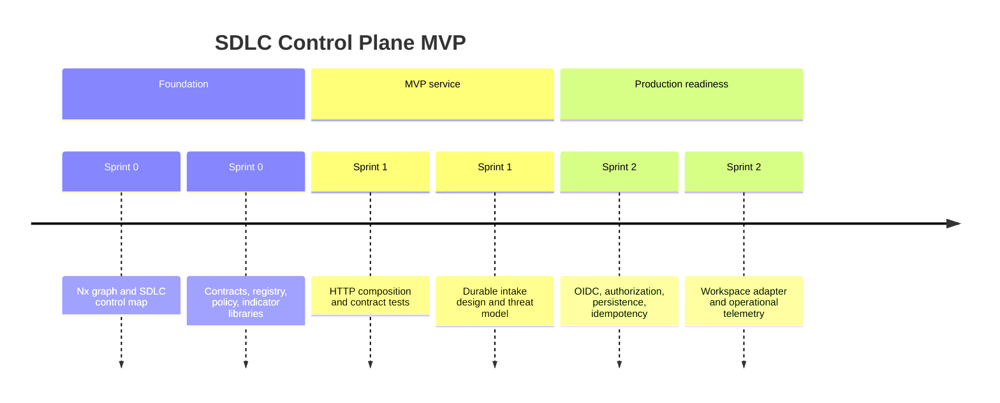

# SDLC Control Plane — Implementation Roadmap

**Version:** 0.1 — September 2026  
**Method:** Vertical slices with proportionate, gate-computed SDLC controls  
**MVP outcome:** one deployable API artifact that accepts validated engineering evidence, evaluates approved guardrails, and exposes descriptive indicators.

## Delivery sequence

| Sprint | Theme | Outcome | Exit gate |
| --- | --- | --- | --- |
| 0 | Architecture foundation | Nx project graph, contracts, policy seam, registry, indicators, control-map generator | Local graph and all project tests pass |
| 1 | MVP service boundary | HTTP composition seam, documented inbound/outbound contracts, integration test plan | Valid evidence yields a deterministic technical disposition |
| 2 | Production hardening | Identity, authorization, durable idempotent storage, audit events, observability | Authenticated end-to-end ingestion is traceable and recoverable |
| 3 | Workspace federation | `ai-ready-nx-workspace` adapter and one named ALM/portfolio integration | Contract and reconciliation tests pass in a sandbox |

## Sprint 0 — Architecture foundation

| ID | Task | Priority | Depends on | Trace | Done when |
| --- | --- | --- | --- | --- | --- |
| 0.1 | Establish Nx project boundaries and graph-derived SDLC component map | Must | — | NFR-1.1 | Five Nx projects are discoverable and the map derives component paths and fan-in from the graph. |
| 0.2 | Define evidence, registration, and guardrail contracts | Must | 0.1 | FR-1.1, FR-2.1, FR-3.1, NFR-1.1 | Contract validator accepts the supported subset and rejects an unknown schema version. |
| 0.3 | Implement registry, policy evaluator, and descriptive indicators | Must | 0.2 | FR-1.2, FR-3.2, FR-4.1 | Unit tests demonstrate no portfolio decision is made by technical policy evaluation. |
| 0.4 | Compose the initial API seam | Must | 0.2, 0.3 | FR-2.2 | Health, workspace, evidence, and indicator paths are testable without network binding. |

## Sprint 1 — MVP service boundary

| ID | Task | Priority | Depends on | Trace | Done when |
| --- | --- | --- | --- | --- | --- |
| 1.1 | Define OpenAPI and error-response contract | Must | 0.4 | FR-2.1, FR-2.2 | Contract tests exercise accepted, invalid, and incompatible evidence responses. |
| 1.2 | Add append-only persistence port and idempotency design | Must | 0.2 | NFR-3.1, NFR-6.1 | ADR identifies the store, idempotency key, retention, and audit-event boundary. |
| 1.3 | Threat-model evidence ingress and policy administration | Must | 1.1 | NFR-2.1, NFR-6.1 | Threat model identifies trust boundaries, abuse cases, mitigations, and residual risks. |

## Sprint 2 — Production hardening

| ID | Task | Priority | Depends on | Trace | Done when |
| --- | --- | --- | --- | --- | --- |
| 2.1 | Implement OIDC workload authentication and workspace authorization | Must | 1.3 | NFR-2.1 | An identity can submit only to authorized registered workspace boundaries. |
| 2.2 | Implement durable evidence store and idempotent intake | Must | 1.2, 2.1 | NFR-3.1 | A replay is safe, durable records survive restart, and audit events are queryable. |
| 2.3 | Add telemetry, health, and retention verification | Should | 2.2 | NFR-3.1, NFR-6.1 | Operators can detect failed ingestion, delayed processing, and retention-policy violations. |

## Sprint 3 — Federation integrations

| ID | Task | Priority | Depends on | Trace | Done when |
| --- | --- | --- | --- | --- | --- |
| 3.1 | Build the `ai-ready-nx-workspace` evidence adapter | Must | 2.2 | FR-2.1 | A fixture workspace publishes contract-valid evidence after its existing gate completes. |
| 3.2 | Integrate one named portfolio/ALM system | Should | 2.1 | FR-1.2, FR-3.2 | External Epic/capability references reconcile without granting automated portfolio authority. |

## Decision gates

| Gate | Condition | Pass condition |
| --- | --- | --- |
| MVP architecture | Before Sprint 1 | Project graph, contract boundaries, ADR-0001, and Sprint 0 tests agree. |
| Production ingress | Before Sprint 2 implementation | Threat model and identity/data-store selections have human approval. |
| External integration | Before Sprint 3 | Integration owner approves mapping, data classification, and reconciliation behaviour. |
