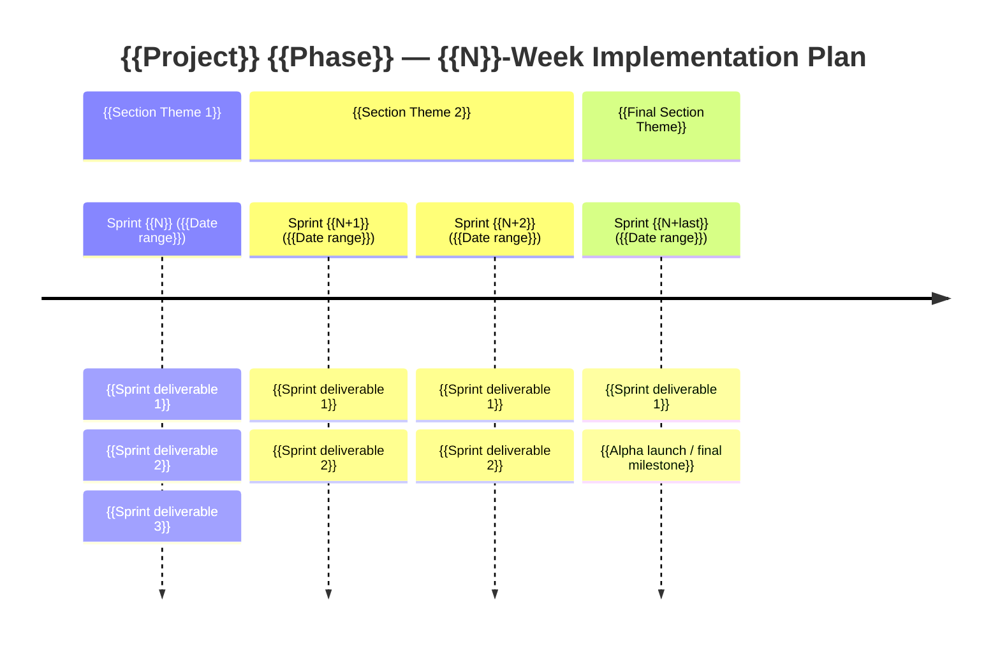

<!--
  Implementation Roadmap Template
  -------------------------------
  Preserve the structure, heading levels, and field names exactly — downstream
  tooling (.ai/prompts/run-task.md reads roadmap rows by column position;
  task IDs flow into branch names, commit scopes, and sprint-progress files)
  depends on the format. Diverge only at the placeholder slots marked with
  `{{double-braces}}` (mustache style).

  Authoring rules:
  1. Every task row in a sprint table MUST fill all 8 columns:
     # | Task | SP | Priority | Layer | Depends on | Trace | Done when
  2. Task IDs follow `<sprint>.<task>` (e.g. 0.1, 1.3). Numbers are LABELS,
     not execution order — execution order comes from `Depends on`.
  3. Never renumber a task after it's executed — tooling and git history
     reference the ID. Add new tasks at the end of the sprint with the next
     available number, even if they belong "logically" mid-sequence.
  4. SP follows the Story Point Reference table (1, 2, 3, 5, 8 only — no 4).
  5. Priority is MoSCoW (Must / Should / Could). No "Won't" — that is omitted.
  6. Layer values are one of: monorepo, frontend, database, auth, api, ai,
     infra, ci, testing, docs, or `<a>+<b>` for cross-layer (e.g. `api+frontend`).
     Add new values to the canonical list before using them in a row.
  7. Trace cell references requirements doc IDs (e.g. `FR-1.1`, `NFR-3.1`,
     `FR-1.x`, `FR-1.1–1.5`) OR the literal `Infra` / `Testing` / `Docs`
     when the task has no FR/NFR trace.
  8. `Done when` MUST be observable / testable in 1 sentence — not "feature
     complete" or "well-tested".
  9. Every sprint MUST have an Execution Waves table grouping unblocked tasks.
     Wave order = the order tasks become unblocked, not strict execution order.
 10. Sprint total SP must be the sum of the SP column. Run a sync check.
 11. Delete the template comment blocks (like this one) before committing
     the real roadmap. Keep the Story Point Reference, MoSCoW, Risk Register,
     and Decision Gates sections — they're load-bearing.
-->

# {{Project}} {{Phase}} Implementation Roadmap

**Prepared by**: {{Author or org name}}
**Version**: {{X.Y — Month YYYY}}
**Duration**: {{N weeks (M sprints x 2 weeks)}}
**Team**: {{Team composition, e.g. "Solo developer (founder)" or "3 engineers + 1 PM"}}
**Methodology**: {{High-level approach, e.g. "Vertical slices — each sprint delivers a working increment"}}

---

## Guiding Principles

| Principle | In practice |
| --------- | ----------- |
| {{Principle 1}} | {{Concrete behaviour or counter-example that operationalises the principle}} |
| {{Principle 2}} | {{...}} |
| {{Principle 3}} | {{...}} |
| {{Principle 4}} | {{...}} |
| {{Principle 5}} | {{...}} |

<!--
  Aim for 4-6 principles. Each row should be a tension you've already
  resolved (X over Y), not a generic platitude. The "In practice" column
  is the test: if you can't write something concrete here, the principle
  is too vague.
-->

---

## Sprint Overview



| Sprint | Dates | Theme | Alpha-testable? |
| ------ | ----- | ----- | --------------- |
| {{N}} | {{Date range}} | {{Theme}} | {{Yes — what user can do / No — reason}} |
| {{N+1}} | {{Date range}} | {{Theme}} | {{...}} |
| {{N+last}} | {{Date range}} | {{Theme}} | **{{Final milestone}}** |

**Target {{milestone name}}**: {{Date}}
**Buffer**: {{e.g. "2 weeks built in (Sprint N is P1 — can be cut if behind schedule)"}}

### Story Point Reference

| SP | Effort | Typical examples |
| -- | ------ | ---------------- |
| 1 | {{< 2 hours}} | {{Trivial scope examples}} |
| 2 | {{Half day}} | {{Small-feature scope examples}} |
| 3 | {{~1 day}} | {{Standard-feature scope examples}} |
| 5 | {{2–3 days}} | {{Large-feature scope examples}} |
| 8 | {{~1 week}} | {{Architectural / refactor scope — should be rare}} |

<!--
  SP buckets are 1, 2, 3, 5, 8 (Fibonacci minus 4). Do not introduce 4 — the
  jump from 3 to 5 represents a real cognitive shift ("can hold whole task in
  head" → "needs intermediate breakdown"). Tasks that estimate as 13+ MUST
  be split before entering the roadmap.
-->

{{Team capacity statement, e.g. "Solo developer capacity: ~30–40 SP per 2-week sprint (8 productive days, ~4–5 SP/day average)."}}

### Sprint Velocity Summary

| Sprint | SP total | Risk level | Largest task | Notes |
| ------ | -------- | ---------- | ------------ | ----- |
| {{N}} | {{SP}} | {{Low / Medium / **High**}} | {{Task name + SP}} | {{Why this sprint is shaped this way}} |
| {{N+1}} | {{SP}} | {{Low / Medium / **High**}} | {{...}} | {{...}} |
| **Total** | **{{Sum}}** | | | {{Average SP/sprint}} |

### Task Priority (MoSCoW)

Each task within a sprint carries a **MoSCoW** priority:

| Priority | Meaning | Action if behind schedule |
| -------- | ------- | ------------------------ |
| **Must** | Blocks the sprint's Definition of Done or the next sprint's start | Cannot defer — reduce scope elsewhere |
| **Should** | Important but sprint can close without it; typically blocks the *next* sprint | Defer to next sprint's first wave |
| **Could** | Adds value but has no downstream dependency | Drop or defer without impact |

### Task Ordering and Execution Waves

Task numbers (0.1, 1.3, etc.) are **labels, not execution order**. The **"Depends on"** column defines the real sequencing. Tasks with no dependency relationship can be worked in any order.

Each sprint includes an **Execution Waves** section showing which tasks can proceed in parallel, grouped by dependency satisfaction. {{Optional: tailor the second sentence for the team shape — solo vs. multi-developer.}}

---

<!--
  Sprint sections (one per sprint)
  --------------------------------
  Each sprint follows the EXACT shape below:

    ## Sprint <N>: <Theme> (<Date range>)

    **Goal:**
    <One paragraph — what the user can newly do at the end>

    **Deliverables:**
    <8-column task table>

    **Sprint total: <SP> SP** — <Risk + 1-line justification>

    **Execution waves:**
    <3-column wave table>

    **Risk checkpoint:**
    <Decisions to make at sprint end if a key signal fails>

    **Definition of done:**
    <Bulleted checklist — observable outcomes a user/reviewer can verify>

  Do not skip any of these subsections — downstream tooling and human
  reviewers expect every sprint to have them.
-->

## Sprint {{N}}: {{Theme}} ({{Date range}})

**Goal:**

{{One paragraph naming the user-visible increment this sprint produces. Avoid "complete X feature" — instead, name what a user can newly do or see.}}

**Deliverables:**

| # | Task | SP | Priority | Layer | Depends on | Trace | Done when |
| - | ---- | -- | -------- | ----- | ---------- | ----- | --------- |
| {{N}}.1 | {{Task description with concrete artifact, e.g. "Scaffold Next.js app in `packages/web`"}} | {{1\|2\|3\|5\|8}} | {{Must\|Should\|Could}} | {{Layer}} | {{— or task IDs}} | {{FR-N.M, NFR-N.M, Infra, Testing}} | {{Observable acceptance}} |
| {{N}}.2 | {{Task description}} | {{SP}} | {{Priority}} | {{Layer}} | {{Deps}} | {{Trace}} | {{Done when}} |
| {{N}}.3 | {{...}} | {{SP}} | {{Priority}} | {{Layer}} | {{Deps}} | {{Trace}} | {{Done when}} |
| {{N}}.4 | {{...}} | {{SP}} | {{Priority}} | {{Layer}} | {{Deps}} | {{Trace}} | {{Done when}} |
| {{N}}.5 | {{...}} | {{SP}} | {{Priority}} | {{Layer}} | {{Deps}} | {{Trace}} | {{Done when}} |

<!--
  Continue rows {{N}}.6, {{N}}.7, ... for every task in this sprint.
  Aim for 8-15 tasks per sprint — fewer means the sprint is too coarse,
  more means split into tasks that can stand alone.
-->

**Sprint total: {{Sum}} SP** — {{Low / Medium / High}} risk. {{One-sentence rationale: which task(s) drive the risk, what is the sprint's most uncertain element.}}

**Execution waves:**

| Wave | Tasks | Rationale |
| ---- | ----- | --------- |
| 1 | {{Comma-separated task IDs}} | {{Why this group is unblocked first — usually "no dependencies" or "depends only on prior sprints"}} |
| 2 | {{Task IDs}} | {{Unblocked by wave 1 — name the dependency}} |
| 3 | {{Task IDs}} | {{...}} |
| 4 | {{Task IDs}} | {{Polish + tests, depends on prior waves}} |

**Risk checkpoint:**

{{What signal at sprint-end indicates the sprint succeeded or failed? What decisions does the team make if the signal fails? Use bullets if multiple decisions.}}

**Definition of done:**

- {{Observable user-visible outcome 1}}
- {{Observable user-visible outcome 2}}
- {{Observable user-visible outcome 3}}
- {{Deployment / verification outcome (e.g. "Deployed to Vercel preview")}}

---

<!--
  Repeat the sprint section for each sprint. Insert milestone blocks
  between sprints when a major capability lands (e.g. "P0 complete").
-->

### Milestone: {{Milestone Name}}

{{One paragraph naming what the milestone signifies, e.g. "After Sprint 4, all P0 features are implemented" — or remove this block if no milestone falls between two sprints.}}

**Definition of done:**

- {{Cumulative observable outcome 1}}
- {{Cumulative observable outcome 2}}

---

## Sprint {{N+1}}: {{Theme}} ({{Date range}})

<!--
  Same shape as Sprint <N>. Repeat for every sprint in the plan.
-->

**Goal:**

{{...}}

**Deliverables:**

| # | Task | SP | Priority | Layer | Depends on | Trace | Done when |
| - | ---- | -- | -------- | ----- | ---------- | ----- | --------- |
| {{N+1}}.1 | {{...}} | {{SP}} | {{Priority}} | {{Layer}} | {{Deps}} | {{Trace}} | {{Done when}} |

**Sprint total: {{Sum}} SP** — {{Risk}}. {{Rationale}}

**Execution waves:**

| Wave | Tasks | Rationale |
| ---- | ----- | --------- |
| 1 | {{Task IDs}} | {{Rationale}} |

**Definition of done:**

- {{Observable outcome}}

---

## Risk Register

| Risk | Likelihood | Impact | Mitigation | Checkpoint |
| ---- | ---------- | ------ | ---------- | ---------- |
| {{Risk description}} | {{Low / Medium / High}} | {{Low / Medium / High}} | {{Concrete mitigation action}} | {{Sprint or date when this is re-evaluated}} |
| {{Risk description}} | {{...}} | {{...}} | {{...}} | {{...}} |

<!--
  Aim for 5-10 risks. Include risks across categories: technical (AI quality,
  infra), operational (team capacity, vendor pause), legal (compliance), and
  market (scope creep). A risk with no checkpoint is a wish — every row needs
  a re-evaluation trigger.
-->

---

## Decision Gates

These are explicit go/no-go decisions at specific points in the timeline.

### Gate {{1}}: {{Gate Name}} (End of Sprint {{N}})

**Question**: {{The single question this gate answers, framed yes/no.}}

| Signal | Go | No-go |
| ------ | -- | ----- |
| {{Signal name}} | {{Concrete observable for "go"}} | {{Concrete observable for "no-go"}} |
| {{Signal name}} | {{...}} | {{...}} |
| {{Signal name}} | {{...}} | {{...}} |

**No-go actions**: {{What the team does if the gate fails — iterate, defer, accept lowered expectations, abandon.}}

### Gate {{2}}: {{Gate Name}} (End of Sprint {{N}})

**Question**: {{...}}

| Signal | {{Go branch label}} | {{No-go branch label}} |
| ------ | ------------------- | ---------------------- |
| {{Signal}} | {{Go criterion}} | {{No-go criterion}} |

### Gate {{N}}: {{Final Gate Name}} (End of Sprint {{last}})

**Question**: {{Is the product ready for [the launch criterion]?}}

{{Either a signal table OR a reference to a checklist elsewhere in the doc, e.g. "All items in the Alpha Readiness Gate checklist must pass. If not, extend by 1 week (max) to close gaps."}}

---

## Post-{{Phase}} Roadmap (High Level)

{{One paragraph: how does forward planning shift after this phase? Usually: from pre-determined plan to user-feedback driven.}}

| Timeframe | Focus | Trigger |
| --------- | ----- | ------- |
| {{Phase + dates, e.g. "Alpha (Jul – Aug 2026)"}} | {{Primary focus area}} | {{What signals the focus shift to the next row}} |
| {{Phase + dates}} | {{...}} | {{...}} |
| {{Phase + dates}} | {{...}} | {{...}} |

---

## Dependency Map

```mermaid
graph TD
    S{{N}}["Sprint {{N}}<br/>{{Short theme}}"] --> S{{N+1}}["Sprint {{N+1}}<br/>{{Short theme}}"]
    S{{N+1}} --> S{{N+2}}["Sprint {{N+2}}<br/>{{Short theme}}"]
    S{{N+1}} --> S{{N+last}}["Sprint {{N+last}}<br/>{{Short theme}}"]
    S{{N+2}} --> S{{N+last}}
    S{{N+cuttable}} -.->|"cuttable"| S{{N+last}}

    style S{{N+cuttable}} stroke-dasharray: 5 5
```

<!--
  The Mermaid graph shows real dependencies between sprints (an arrow means
  "the target sprint cannot start until the source sprint finishes its DoD").
  Use a dashed edge + `stroke-dasharray: 5 5` styling for any sprint that is
  cuttable from the critical path. If no sprint is cuttable, omit the dashed
  edge and the style line.
-->

{{Optional one-line annotation explaining the cuttable sprint(s), e.g. "Sprint N is the only sprint with a dashed dependency — it can be skipped without blocking Sprint N+1."}}

---

*Version {{X.Y}} — {{Month YYYY}}*
